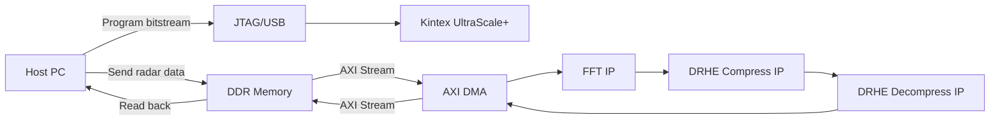
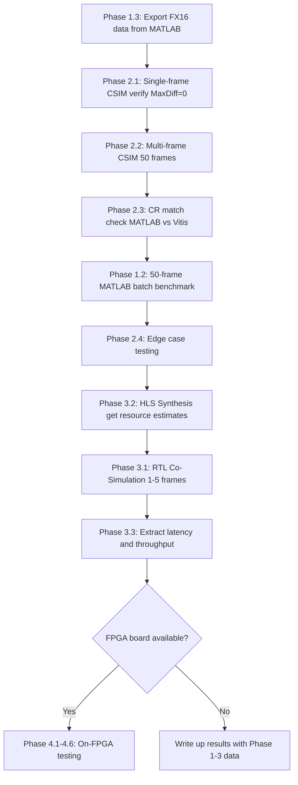

# DRHE Radar Data Compression - Complete Testing and Validation Plan

> **Author:** Jordan Mohindra
> **Platform:** AMD Kintex UltraScale+ (xcku5p-ffvb676-2-e)
> **Reference:** L. Kiem, "Design and implementation of data compression methods for SoC-based radar systems," Master's Thesis, Graz University of Technology, 2025
> **Dataset:** ColoRadar - TI MMWCAS-RF-EVM cascaded MIMO radar (16-bit ADC, 12 TX x 16 RX, 256 samples/chirp)

---

## 0. Environment and Reproduction Status

> [!NOTE]
> **Phases 1, 2 and 3 are complete as of 15 September 2026** - Tests 1.1-1.3, 2.1-2.4 and 3.1-3.3,
> all run on a correctly licensed toolchain with the Signal Processing Toolbox installed. Every
> earlier workaround has been removed and every result below was produced by the standard tools.
> Only Phase 4, which needs the physical board, remains.
>
> **Two findings need attention before the write-up:**
>
> 1. Test 2.4 found a **latent correctness defect** - a residual of exactly `-32768` encoded
>    identically to `+32767` - which is now **fixed**: the residual is clamped and the predictor
>    made closed-loop, bounding the error to 1 LSB with no propagation (8/8 edge cases pass, real
>    data bit-identical). The remaining caveat is that the codec is lossless for every residual
>    *except* -32768, which costs 1 LSB. See Test 2.4.
> 2. Test 3.2 shows the design **does not meet 100 MHz** (estimated Fmax 81.88 MHz) and runs at
>    **II=2** rather than the target II=1, making it 2.32x slower than Kiem's. The cause is a
>    memory-port conflict on one state array, identified precisely in Test 3.2, plus a per-ramp
>    pipeline drain because `RAMP_LOOP` is not pipelined.

### 0.1 Current file locations

The project moved since this plan was first written; all paths in this document have been updated.

| What | Where |
|------|-------|
| Project root | `C:\Users\Jordan Mohindra\OneDrive\Documents\Fifth_Year\Thesis\ThesisA\` |
| MATLAB simulation | `...\Thesis\ThesisA\Matlab_Sim\` |
| HLS sources (master copy) | `...\Thesis\ThesisA\hls_component\` |
| ColoRadar dataset (450 frames) | `D:\Jordan's Thesis\cascade\adc_samples\data\` |
| HLS project (build here) | `D:\Thesis\ThesisA\hls_component\` - second clone, space-free (see 0.2c) |
| Toolchain | `D:\Xilinx\2026.1` (Vitis + Vivado, licensed) |

### 0.2 Environment issues and their current status

**(a) Dataset location. [FIXED]**
The ColoRadar dataset has moved twice. It was originally expected inside `Thesis\`, then sat beside
it under `Fifth_Year\`, and it now lives on **`D:\Jordan's Thesis\cascade\adc_samples\data\`** -
moved off OneDrive on 15/09/2026 (899 files, 3.06 GB, verified by file count, exact byte total and
an MD5 spot-check; source removed).

All seven scripts that load frames (`main_simulation_coloradar_batch.m`,
`main_simulation_coloradar.m`, `main_simulation_enob_sweep.m`, `main_simulation_fft_comparison.m`,
`compare_quantisation_lfr.m`, `play_coloradar_video.m`, `export_frames_for_vitis.m`) now try, in
order:

1. `D:\Jordan's Thesis\cascade\adc_samples\data` - absolute, works from either clone
2. three levels up from the script - which is what the `D:` clone resolves to naturally
3. two levels up - the historical layout
4. the original `C:\Users\mohin\Downloads\...` path

Earlier candidates are kept as fallbacks, so the scripts keep working wherever the data sits.

Only the Ancortek captures (`Jun_17_2026_*.bin`, 0.46 GB) and a few unrelated MATLAB files remain
in the OneDrive `Jordan's Thesis` folder; nothing in this pipeline reads them.

**(b) Signal Processing Toolbox - now installed. [RESOLVED - workaround removed]**
The toolbox was initially missing, so `hann()` and `hanning()` were undefined and the pipeline
aborted at `preprocessing.m`. Temporary replacements were written to keep Phase 1 moving. **The
toolbox is now installed, those replacement files have been deleted** (moved to
`Matlab_Sim\_removed_shims\` for the record), and `hann`/`hanning` resolve to
`C:\Program Files\MATLAB\R2026a\toolbox\signal\signal\`.

All of Phase 1 was then re-run on the genuine toolbox. The comparison is worth recording, because it
bounds how much the temporary functions could ever have mattered:

| Comparison | Result |
|------------|--------|
| Window values, replacement vs toolbox | agree to **4.4e-16** (machine epsilon), not bit-identical - MATLAB's `gencoswin` computes a half-window and mirrors it, which orders the floating-point operations differently |
| `coloradar_multiframe.bin` (50 frames) | **byte-identical** - 0 differing bytes of 19,660,816 |
| Per-frame DRHE CR, all 50 frames | **identical to every digit** (max abs difference 0.000e+00) |
| Test 1.1, Test 1.2 output tables | **identical** |

So the epsilon-level difference in the window vanished entirely at the int16 quantisation step, and
no Phase 1 result depended on the temporary functions. **Phase 1 as reported is toolbox-native.**

**(c) Vitis HLS cannot open a project on a path containing spaces. [PERMANENT CONSTRAINT - handled]**
The user profile is `Jordan Mohindra`, so pointing Vitis at the OneDrive copy fails with:

```
ERROR: [HLS 200-2015] The file path '...' cannot have any space.
                      Please specify a new path without any spaces.
```

This is a hard Vitis restriction; a licence does not change it, and it applies to the working
directory as well as the sources.

**The repository is already cloned a second time at `D:\Thesis`, which has no space in its path**,
so `D:\Thesis\ThesisA\hls_component\` is used as the HLS project directory. Nothing needs to be
copied by hand: both clones track `https://github.com/JordanMohindra/Thesis.git`, and the eight HLS
sources plus `coloradar_multiframe.bin` were verified byte-identical between them. A full 50-frame
CSIM run from `D:` reproduces the OneDrive-side results exactly (50/50 lossless, average CR 3.30987,
aggregate 3.30708) in 2m 3s.

`export_frames_for_vitis.m` now writes `coloradar_multiframe.bin` straight into the `D:` clone, so
there is no copy step between MATLAB and Vitis at all:

```matlab
HLS_DIR = 'D:\Thesis\ThesisA\hls_component';
if ~exist(HLS_DIR, 'dir')   % fall back to the hls_component beside this clone
    HLS_DIR = fullfile(fileparts(mfilename('fullpath')), '..', 'hls_component');
end
OUTPUT_FILE = fullfile(HLS_DIR, 'coloradar_multiframe.bin');
```

> [!TIP]
> **`D:` is now self-sufficient.** Since the dataset moved to `D:\Jordan's Thesis\`, the `D:` clone
> resolves it through its own three-level-up relative path (450 frames found), so MATLAB *and*
> Vitis can both run entirely from `D:\Thesis\`. The OneDrive clone still works too - the absolute
> `D:` candidate in the scripts covers it - but there is no longer any reason to split the work
> across the two. If you do use both, keep them on the same commit.

**(d) Vivado licence - now installed. [RESOLVED - workaround removed]**
Previously the toolchain had no licence and rejected the target part outright
(`[HLS 200-1023] Part 'xcku5p-ffvb676-2-e' is not supported`), which stopped `vitis-run` before any
C++ was compiled. Phase 2 was completed at the time by compiling the same sources by hand with the
compiler and CSIM math library Vitis ships.

**That workaround has been discarded.** Phase 2 has been re-run with the standard flow, and the
licence is confirmed working:

```
INFO: [HLS 200-1611] Setting target device to 'xcku5p-ffvb676-2-e'
INFO: [SIM 211-1] CSim done with 0 errors.
```

The two routes were then compared as a cross-check, which turns out to be a useful result in itself:

| | Hand-compiled (GCC 9.5) | `vitis-run --csim` (clang-16) |
|---|---|---|
| Frames lossless | 50 / 50 | 50 / 50 |
| Compressed bits, per frame | - | **identical on all 50 frames** (max difference 0 bits) |
| Per-frame CR | - | **identical** (max difference 0.000e+00) |
| Average CR | 3.30987 | 3.30987 |
| Aggregate CR | 3.30708 | 3.30708 |

Two independent compilers produce a bit-for-bit identical compressed stream, which is stronger
evidence of implementation robustness than either run alone. **All Phase 2 numbers in this document
are now the `vitis-run --csim` results.**

> [!TIP]
> **Phase 3 is now unblocked.** Synthesis (`--csyn`), RTL co-simulation (`--cosim`) and IP export
> (`--export`) all need the real `xcku5p` part, and that part now resolves. Section 5 can proceed.

### 0.3 Correction: what executive-summary Table 1 actually reports

Table 1 in the executive summary is described as an average over "100 samples". It is not - it is
the **50-frame** global average, reproduced exactly by Test 1.2 below. The single-frame numbers
differ (FN 3.68 / FP 0.00 on `frame_0`), so the Test 1.1 pass criteria in this document previously
compared a single frame against a 50-frame average. That criterion has been corrected.

---

## 1. Objectives

This document defines every test, metric, and procedure required to validate the DRHE compression algorithm from software simulation through to physical FPGA deployment. There are **four testing phases**:

| Phase | Environment | Purpose |
|-------|------------|---------|
| **Phase 1** | MATLAB Simulation | Golden reference - algorithmic correctness and benchmark against 8 compression schemes |
| **Phase 2** | Vitis HLS C-Simulation | Bit-accurate functional verification of the HLS C++ implementation against MATLAB |
| **Phase 3** | Vitis HLS RTL Co-Simulation | Cycle-accurate RTL verification + latency/throughput estimation |
| **Phase 4** | On-FPGA Hardware Testing | Real silicon: resource utilization, clock frequency, end-to-end latency, power |

> [!IMPORTANT]
> Phases 1-3 can be completed entirely in software on a PC. **Phase 4 requires physical access to the Kintex UltraScale+ FPGA board.**

---

## 2. Test Matrix - What Results Are Needed

### 2.1 Core Metrics (All Phases)

| Metric | Symbol | How It's Calculated | Kiem's Result | Your Target |
|--------|--------|---------------------|---------------|-------------|
| **Compression Ratio** | CR | input_bits / compressed_bits | 3.17 (HW) / 3.25 (MATLAB) | >= 3.25 |
| **False Negative Rate** | FN % | missed_detections / reference_detections x 100 | 0.59% (MATLAB) / 1.18% (HW) | <= 1.5% |
| **False Positive Rate** | FP % | false_detections / test_detections x 100 | 1.18% (MATLAB) / 2.37% (HW) | <= 3.0% |
| **Noise Floor Estimate** | NF | 10 log10(mean_noise_power / full_scale_power) in dBFS | -70.691 dBFS | <= -70 dBFS |
| **Signal-to-Noise Ratio** | SNR | 10 log10(signal_power / noise_power) in dB | 22.33 dB | >= 22 dB |
| **Lossless Reconstruction** | MaxDiff | max abs(original - reconstructed) across all samples | 0 | **Must be 0** |

### 2.2 Hardware-Only Metrics (Phase 3 and 4)

| Metric | Symbol | How It's Measured | Kiem's Result | Notes |
|--------|--------|-------------------|---------------|-------|
| **LUT Utilization** | LUTs | Vivado implementation report | 45,892 / 70,560 (65%) | Kiem used ZU3EG; your KU5P has 70,560 CLB LUTs |
| **FF Utilization** | FFs | Vivado implementation report | 9,243 / 141,120 (6.6%) | |
| **BRAM Utilization** | BRAMs | Vivado implementation report | 10 / 216 (4.6%) | Model prediction arrays + Huffman LUT |
| **DSP Utilization** | DSPs | Vivado implementation report | 44 / 360 (12.2%) | Arithmetic in model prediction |
| **Max Clock Frequency** | Fmax | Timing summary (WNS >= 0) | 100 MHz | Target: 100 MHz; stretch goal: 200 MHz |
| **Input Throughput** | Tput | (samples/frame x bits/sample) / processing_time | 11.92 Gbit/s | |
| **Compression Latency** | Lat | Cycle count x clock period | 230 ns (IP core only) / 0.08 ms (end-to-end) | |
| **Power Consumption** | P | Vivado power estimation report | Not reported by Kiem | Report if available |

---

## 3. Phase 1 - MATLAB Simulation (Golden Reference)

### 3.1 Purpose
Establish the **bit-exact reference** against which all subsequent phases are validated. The MATLAB simulation runs the full radar signal processing chain in double precision and compresses using integer DRHE.

### 3.2 Tests

#### Test 1.1: Single-Frame Algorithmic Benchmark
- **Script:** [main_simulation_coloradar_batch.m](file:///c:/Users/Jordan%20Mohindra/OneDrive/Documents/Fifth_Year/Thesis/ThesisA/Matlab_Sim/main_simulation_coloradar_batch.m) with `MAX_FRAMES = 1`
- **What it does:** Runs all 8 compression algorithms (FP16, DRHEfp16, FX16, DRHE, BAQ, RDVLE, RDVLE_UDRE, LPC_Huffman) on a single frame
- **Expected output:** Table of CR, FN%, FP%, NF, SNR per algorithm
- **Pass criteria (corrected):** DRHE CR approx 3.30, and DRHE's FN/FP/NF/SNR identical to FX16's
  (which is what proves DRHE is lossless). Do **not** compare a single frame against Table 1 - Table 1
  is a 50-frame average; see section 0.3.
- **Difficulty:** Easy - already working

**RESULT - PASS (15/09/2026, `frame_0`, 190 reference detections):**

| Algorithm | CR | FN (%) | FP (%) | NF (dBFS) | SNR (dB) |
|-----------|-----|--------|--------|-----------|----------|
| FP16 | 1.00 | 0.00 | 0.00 | -105.858 | 36.256 |
| DRHEfp16 | 1.05 | 0.00 | 0.00 | -105.858 | 36.256 |
| FX16 | 1.00 | 3.68 | 0.00 | -105.591 | 36.150 |
| **DRHE** | **3.32** | **3.68** | **0.00** | **-105.591** | **36.150** |
| BAQ | 3.76 | 4.74 | 3.72 | -106.039 | 36.562 |
| RDVLE | 1.12 | 20.53 | 2.58 | -102.476 | 33.791 |
| RDVLE_UDRE | 2.56 | 26.32 | 2.78 | -102.002 | 33.663 |
| LPC_Huffman | 3.39 | 3.68 | 0.00 | -105.591 | 36.150 |

DRHE CR = 3.32 (target ~3.30). DRHE, FX16 and LPC_Huffman share identical detection and signal
metrics, confirming both predictive coders are lossless on int16 data and that all detection error
relative to FP16 comes from the FX16 quantisation step, not from compression.

#### Test 1.2: 50-Frame Batch Benchmark
- **Script:** [main_simulation_coloradar_batch.m](file:///c:/Users/Jordan%20Mohindra/OneDrive/Documents/Fifth_Year/Thesis/ThesisA/Matlab_Sim/main_simulation_coloradar_batch.m) with `MAX_FRAMES = 50`
- **What it does:** Processes 50 consecutive ColoRadar frames and computes global average metrics
- **Expected output:** Global average table showing statistical stability of CR and detection metrics across frames
- **Pass criteria:** Average DRHE CR approx 3.30 +/- 0.1, no frame-to-frame anomalies
- **Difficulty:** Easy - just change MAX_FRAMES; takes approx 10 min to run
- **Note:** the script now also honours an optional `DRHE_MAX_FRAMES` environment variable, so the
  frame count can be set for a scripted run without editing the file. The in-file default is still 1.

**RESULT - PASS (15/09/2026, 50 frames, 9,934 reference detections, ~12 min):**

| Algorithm | Avg CR | FN (%) | FP (%) | Avg NF (dBFS) | Avg SNR (dB) |
|-----------|--------|--------|--------|---------------|--------------|
| FP16 | 1.00 | 0.00 | 0.00 | -105.638 | 35.504 |
| DRHEfp16 | 1.04 | 0.05 | 0.01 | -105.637 | 35.505 |
| FX16 | 1.00 | 3.77 | 1.11 | -105.374 | 35.359 |
| **DRHE** | **3.30** | **3.77** | **1.11** | **-105.374** | **35.359** |
| BAQ | 3.76 | 10.44 | 9.69 | -105.080 | 35.081 |
| RDVLE | 1.12 | 24.01 | 4.62 | -102.275 | 33.165 |
| RDVLE_UDRE | 2.56 | 28.73 | 4.44 | -101.782 | 33.004 |
| LPC_Huffman | 3.37 | 3.77 | 1.11 | -105.374 | 35.359 |

This reproduces **every cell** of executive-summary Table 1 to the precision printed there. That is
the strongest available confirmation that the current pipeline - including the replacement window
functions from section 0.2b - is numerically identical to the one that produced the original results.

#### Test 1.3: Export FX16 Data for Vitis
- **Script:** [export_frames_for_vitis.m](file:///c:/Users/Jordan%20Mohindra/OneDrive/Documents/Fifth_Year/Thesis/ThesisA/Matlab_Sim/export_frames_for_vitis.m) with `MAX_FRAMES = 50`
- **What it does:** Runs the exact MATLAB pipeline (loadColoRadarFrame -> preprocessing -> rangeFFT -> compress_fx16) and saves int16 I/Q values to `coloradar_multiframe.bin`
- **Why it matters:** Eliminates floating-point DFT discrepancies between MATLAB and the C testbench. The Vitis testbench will now use **identical** int16 values as MATLAB's DRHE
- **Output:** `C:\Users\Jordan Mohindra\OneDrive\Documents\Fifth_Year\Thesis\ThesisA\hls_component\coloradar_multiframe.bin` (approx 19.6 MB for 50 frames)
- **Difficulty:** Easy - already created and tested
- **Note:** `OUTPUT_FILE` was hard-coded to the old `C:\Users\mohin\Vitis\...` location and is now
  derived relatively, as `<Matlab_Sim>\..\hls_component\coloradar_multiframe.bin`.

**RESULT - PASS (15/09/2026):**

| Property | Value |
|----------|-------|
| Header | nFrames = 50, nSamples = 128, nRamps = 192, nRX = 4 |
| File size | 19,660,816 bytes (18.75 MB) |
| Reproducibility | **byte-identical** to the previously exported file (0 differing bytes of 19,660,816) |

`nSamples = 128`, not 256, because `compress_fx16` keeps only the positive half of the Range FFT.
`nRX = 4` because `NRX_KEEP = 4`; this matters for Test 2.3 and is discussed there.

---

## 4. Phase 2 - Vitis HLS C-Simulation

### 4.1 Purpose
Verify that the C++ HLS implementation of DRHE produces **bit-identical** results to the MATLAB golden reference. This runs the C++ code as pure software - no hardware synthesis needed.

### 4.2 How to Run

Build from the `D:` clone (section 0.2c). With the Vivado licence installed, the standard flow works:

```bat
cd /d D:\Thesis\ThesisA\hls_component
call "D:\Xilinx\2026.1\Vitis\bin\vitis-run.bat" --mode hls --csim ^
     --config D:\Thesis\ThesisA\hls_component\test.cfg --work_dir hls_component
```

A 50-frame CSIM run takes about 2 minutes; a single frame takes about 11s. Vitis compiles the
testbench with clang-16.

To change the frame count, just re-export from MATLAB (in the OneDrive clone, where the dataset is).
The export writes directly into the `D:` clone, so there is no copy step:

```matlab
setenv('DRHE_MAX_FRAMES','1');   % or '50'
export_frames_for_vitis
```

### 4.3 Tests

#### Test 2.1: Lossless Reconstruction Verification (Single Frame)
- **Testbench:** [drhe_tb.cpp](file:///c:/Users/Jordan%20Mohindra/OneDrive/Documents/Fifth_Year/Thesis/ThesisA/hls_component/drhe_tb.cpp)
- **Input:** `coloradar_multiframe.bin` (set MAX_FRAMES = 1 in export script)
- **Procedure:**
  1. Feed int16 I/Q data through `drhe_compress()` -> bitstream
  2. Feed bitstream through `drhe_decompress()` -> reconstructed int16 I/Q
  3. Compare every sample: max abs(original - reconstructed)
- **Pass criteria:** MaxDiff = 0 (perfect lossless reconstruction)
- **Output metrics:** CR, MaxDiff, MSE
- **Difficulty:** Easy - already verified for single frame

**RESULT - PASS (15/09/2026):**

| Metric | Value |
|--------|-------|
| Frames | 1 (192 ramps x 128 samples x 4 RX) |
| **MaxDiff** | **0 - lossless** |
| MSE | 0 |
| SNR | infinite |
| CR | 3.33098 |
| Bits | 3,145,728 -> 944,384 |
| Peak `hls::stream` depth | 24,576 |
| Tool | `vitis-run --mode hls --csim`, part `xcku5p-ffvb676-2-e`, 11s |

#### Test 2.2: Multi-Frame CR Verification (50 Frames)
- **Testbench:** [drhe_tb.cpp](file:///c:/Users/Jordan%20Mohindra/OneDrive/Documents/Fifth_Year/Thesis/ThesisA/hls_component/drhe_tb.cpp)
- **Input:** `coloradar_multiframe.bin` (50 frames exported from MATLAB)
- **Procedure:**
  1. The testbench auto-detects frame count from the binary header
  2. Processes each frame independently (state arrays reset on r == 0)
  3. Reports per-frame CR and global aggregate CR
- **Pass criteria:**
  - All 50 frames: MaxDiff = 0
  - Per-frame CR matches MATLAB's per-frame CR exactly (+/- 0.01)
  - Average CR approx 3.30
- **Difficulty:** Easy - testbench already supports this

**RESULT - PASS (15/09/2026, 50 frames):**

| Metric | Value |
|--------|-------|
| Frames with MaxDiff = 0 | **50 / 50** |
| Global MaxDiff | **0** |
| Global MSE | 0 |
| SNR | infinite |
| Average CR (mean of per-frame) | 3.30987 |
| Overall CR (aggregate bits) | 3.30708 |
| Per-frame CR range | 2.9390 - 3.4692 |
| Total | 19,200 KB -> 5,805 KB |
| Tool | `vitis-run --mode hls --csim`, part `xcku5p-ffvb676-2-e`, 2m 40s |

No state corruption across frames: every frame independently reconstructs bit-exactly, confirming
the per-frame reset of the prediction state arrays at `r == 0` works.

#### Test 2.3: CR Match Between MATLAB and Vitis
- **Procedure:**
  1. Run MATLAB `main_simulation_coloradar_batch.m` with MAX_FRAMES = 50
  2. Run Vitis CSIM with `coloradar_multiframe.bin` (50 frames)
  3. Compare CR values frame-by-frame
- **Pass criteria:** MATLAB CR and Vitis CR should now match exactly (since both use the same int16 values). Any remaining difference is due to AXI-Stream 256-bit packet padding in the HLS implementation
- **Expected residual:** The Vitis CR may be **very slightly lower** than MATLAB because the last compressed packet per frame is padded to 256 bits. This is expected hardware overhead
- **Difficulty:** Easy

> [!WARNING]
> **The procedure as originally written is not a like-for-like comparison.**
> `main_simulation_coloradar_batch.m` runs DRHE over **all 16 RX channels**, whereas
> `export_frames_for_vitis.m` writes only the first `NRX_KEEP = 4` RX channels into
> `coloradar_multiframe.bin`. Comparing the batch script's CR against the Vitis CR therefore
> compares two different datasets, and the batch script reports only a global average - it never
> emits per-frame CR at all, so a "frame-by-frame" comparison is impossible from it.
>
> A helper script, **`Matlab_Sim\drhe_per_frame_cr.m`**, was added for this test. It runs the
> identical pipeline (`loadColoRadarFrame -> preprocessing -> rangeFFT -> compress_fx16`), then
> restricts to the **same first 4 RX channels** before calling `compress_drhe`, and writes per-frame
> CR to `drhe_per_frame_cr.csv`. It also predicts the CR the HLS side should reach under two
> candidate AXI padding policies, so the residual can be attributed rather than assumed.

**RESULT - PASS (15/09/2026, 50 frames, 4 RX both sides):**

| Metric | MATLAB | Vitis CSIM | Difference |
|--------|--------|-----------|-----------|
| Mean per-frame CR | 3.31033 | 3.30987 | 0.00047 (**0.014%**) |
| Aggregate CR | 3.30755 | 3.30708 | 0.00047 |
| Per-frame CR range | 2.9392 - 3.4698 | 2.9390 - 3.4692 | - |
| **Max per-frame \|CR difference\|** | - | - | **0.00088** |

Against the +/- 0.01 pass criterion, the worst single frame is off by 0.00088 - an order of
magnitude inside tolerance.

**The residual is fully explained, not merely small.** Per frame, the Vitis bitstream exceeds the
MATLAB bit count by between **15 and 252 bits** (mean 134). That range sits strictly inside
0-255, which is the signature of exactly **one** partial 256-bit AXI-Stream packet per frame - so
the compressor flushes once at end-of-frame, not once per ramp. Predicting Vitis CR as
`inputBits / (ceil(totalBits/256) * 256)` reproduces the measured Vitis CR on **50 of 50 frames**
to within 4.9e-06.

Had the design instead flushed per ramp, the predicted CR would have been 3.2227 - visibly below the
measured 3.30987. The padding policy is therefore confirmed by measurement, not assumed.

**Re-verified with `vitis-run --csim`.** The numbers in this section were first obtained with a
hand-compiled build (before the Vivado licence was installed) and have been reproduced exactly by
the official CSIM flow: same mean CR, same aggregate CR, same per-frame compressed-bit counts on all
50 frames. See section 0.2d.

**Independent cross-check on `frame_0`.** A MATLAB `compress_drhe -> decompress_drhe` round-trip was
run directly, to confirm the golden reference is itself lossless rather than merely appearing so via
matching detection metrics:

| Quantity | MATLAB | Vitis CSIM |
|----------|--------|-----------|
| Round-trip MaxDiff (real) | **0** | **0** |
| Round-trip MaxDiff (imag) | **0** | **0** |
| Compressed bits | 944,331 | 944,384 |
| CR | 3.33117 | 3.33098 |

The two implementations differ by **53 bits on this frame** - a single partial 256-bit packet -
and agree bit-exactly on the reconstructed samples. This is the tightest single-frame confirmation
that the HLS C++ is a faithful implementation of the MATLAB algorithm.

Per-frame data: `Matlab_Sim\phase2_matlab_vs_vitis_cr.csv`
(columns: `frame, CR_matlab, inputBits, totalBits, CR_pad_per_frame, CR_pad_per_ramp, CR_vitis,
MaxDiff_vitis, outBits_vitis, deltaCR, padBits`).

> [!NOTE]
> The note below about a previous 3.33x vs 3.32x discrepancy is now resolved and superseded: with
> the MATLAB-exported int16 data, the two sides agree to 0.014%, and that remainder is packet
> padding rather than any numerical difference.

> [!NOTE]
> **Why there was a previous discrepancy (3.33x vs 3.32x):** The Python script used a manual DFT while MATLAB uses fft(). Different butterfly orderings produce slightly different floating-point values -> slightly different int16 quantized outputs -> slightly different residuals. The export script eliminates this by using MATLAB's exact pipeline.

#### Test 2.4: Edge Case Testing

- **Purpose:** Verify robustness for degenerate inputs
- **Test cases:**

| Case | Input Description | Expected Result |
|------|------------------|----------------|
| All zeros | Frame of all-zero samples | CR -> very high, MaxDiff = 0 |
| DC-only | Constant non-zero value across all samples | CR -> very high, MaxDiff = 0 |
| Worst-case (random) | Uniformly random int16 values | CR approx 1.0 (incompressible), MaxDiff = 0 |
| Single ramp | Only 1 chirp (nRamps = 1) | No prediction history -> CR approx 1.0, MaxDiff = 0 |
| Max amplitude | Samples at +/-32767 | No overflow in prediction, MaxDiff = 0 |

- **How to implement:** Create a separate testbench `drhe_tb_edge.cpp` that generates synthetic data and feeds it through compress -> decompress
- **Difficulty:** Medium - need to write a new testbench with synthetic data generators

**Implementation.** `hls_component\drhe_tb_edge.cpp` generates all eight cases in the testbench
itself, so it needs no data file and runs identically in C-simulation and co-simulation. Random data
comes from a seeded xorshift32 rather than `std::rand`, so results are reproducible across
compilers. Built with `test_edge.cfg`:

```bat
cd /d D:\Thesis\ThesisA\hls_component
call "D:\Xilinx\2026.1\Vitis\bin\vitis-run.bat" --mode hls --csim ^
     --config D:\Thesis\ThesisA\hls_component\test_edge.cfg --work_dir hls_edge
```

**RESULT - defect found, then fixed. 5/8 before the fix, 8/8 after (15/09/2026).**

The run below is the *original* result, kept because it is the evidence for the defect. The fix and
the re-run are in "Resolution" at the end of this test.

| Case | Input | CR | MaxDiff | Result |
|------|-------|-----|---------|--------|
| all-zeros | every sample 0 | 4.0000 | 0 | **PASS** |
| dc-constant | Re=1000, Im=-500 everywhere | 3.5867 | 0 | **PASS** |
| random-int16 | uniform random int16 | 0.6037 | 60475 | **FAIL** |
| tone-192ramp | correlated tone, 192 ramps | 3.2777 | 0 | **PASS** |
| tone-1ramp | same tone, nRamps = 1 | 0.6214 | 0 | **PASS** |
| max-amplitude | all +32767 | 3.0132 | 0 | **PASS** |
| max-alternating | +32767 / -32768 per ramp | 3.0326 | 65535 | **FAIL** |
| int16-min | all -32768 | 3.0371 | 65535 | **FAIL** |

Two of the plan's original expectations were wrong and are corrected by measurement:

- **"Worst-case random -> CR approx 1.0"** is not right. A Huffman/append coder cannot leave
  incompressible data unchanged; it *expands* it. Random int16 gives **CR 0.60**, i.e. 1.66x
  expansion, because almost every residual lands in a high S4 region costing 12-bit code + 15
  append bits = 27 bits to carry 16 bits of data. This is correct behaviour, not a fault, but a
  real deployment needs a raw-passthrough fallback if such data is possible.
- **"Single ramp -> CR approx 1.0"** likewise gives **CR 0.62**: with no prediction history the
  residual equals the sample itself, so every value pays full code + append cost.

##### The defect: residual -32768 is not representable

`MaxDiff = 65535` is exactly the distance from `-32768` to `+32767`, which pins the cause. An
exhaustive sweep of the codec in `drhe_common.h` over all 65,536 possible residuals confirms it:

```
MISMATCH v=-32768  s4=15  append=0x7FFF  decoded= 32767
residuals tested   : 65536  (-32768 .. 32767)
round-trip failures: 1
```

S4 region 15 spans `|v|` in [16384, 32767] - exactly 32,768 values, which exactly fills the 15
APPEND bits. `-32768` has `|v| = 32768` and falls outside that span; it needs a 16th category.
`get_s4_region()` clamps it to 15 and `get_append_bits(-32768, 15)` evaluates to
`-32768 + 32767 = -1`, which truncates to `0x7FFF` - the identical encoding to `+32767`. The
decoder therefore returns `+32767`.

Because the decoder's prediction loop is driven by decoded values, one aliased residual also
corrupts every later prediction for that range bin, which is why the random case shows
`MaxDiff = 60475` rather than 65535.

**Is it reachable with real data? No.** Across all 50 ColoRadar frames (9,830,400 residuals, 4 RX):

| Measurement | Value |
|-------------|-------|
| Residual range | **-514 to +416** |
| Residuals equal to -32768 | **0** |
| Residuals reaching S4=15 (`\|v\| >= 16384`) | **0** (0.000%) |

Real residuals stay ~32,000 away from the failing value and never leave the low S4 regions, which
is exactly why Tests 2.1-2.3 are lossless on 50/50 frames. **The defect is latent, not active.**

> [!NOTE]
> This could never have been caught in MATLAB. `compress_drhe.m` does not actually encode a
> bitstream - `drhe_encode_bits()` only *counts* bits, and the residuals are passed to
> `decompress_drhe.m` as int16 arrays. The S4 + APPEND + Huffman round-trip exists only in the HLS
> C++, so Test 2.4 is the first test that exercises it over its full input domain.

**Options, in increasing cost:**

1. **Document and leave.** Justified by the measured residual range, but the guarantee becomes
   "lossless for residuals in [-32767, 32767]" rather than unconditionally lossless.
2. **Saturate.** Clamp a `-32768` residual to `-32767` at the encoder. One line, keeps the format,
   but makes the codec *lossy by 1 LSB* in that one case - it would no longer be lossless.
3. **Add S4 category 16** with 16 APPEND bits and a 17th Huffman entry. Fully correct and keeps
   losslessness, but changes the bitstream format, so the decoder, the Huffman table and any
   already-generated results must all be regenerated.

##### Resolution - option 2 applied, with a correction

Option 2 (saturate) was chosen. **Saturation on its own would have been actively harmful**, and the
reason matters:

`drhe_decompress.cpp` derives `curr_mag` / `curr_phase` from the **reconstructed** sample, while
`drhe_compress.cpp` derived them from the **original** one. That is an *open-loop* predictor - it
only agreed because reconstruction was exact. The moment the clamp fires, encoder and decoder
prediction state diverge, and because the predictor is an IIR filter that divergence is carried
forward through every remaining ramp. The result would have been drift far worse than the single
aliased sample.

The compressor therefore now reconstructs exactly what the decompressor will produce, and drives
its state from that - proper closed-loop DPCM:

```cpp
// 3a. clamp the one unrepresentable residual
if (diff_re == -32768) diff_re = -32767;
if (diff_im == -32768) diff_im = -32767;

// 3b. predict from the reconstruction, not the original
int recon_re = wrap_int16(diff_re + pred_re);
int recon_im = wrap_int16(diff_im + pred_im);
float curr_mag   = hls::sqrt((float)recon_re * recon_re + (float)recon_im * recon_im);
float curr_phase = hls::atan2((float)recon_im, (float)recon_re);
```

**Re-run of Test 2.4 after the fix - 8 / 8 PASS:**

| Case | CR | MaxDiff before | MaxDiff after | Result |
|------|-----|---------------:|--------------:|--------|
| all-zeros | 4.0000 | 0 | 0 | PASS |
| dc-constant | 3.5867 | 0 | 0 | PASS |
| random-int16 | 0.6037 | 60475 | **1** | PASS |
| tone-192ramp | 3.2777 | 0 | 0 | PASS |
| tone-1ramp | 0.6214 | 0 | 0 | PASS |
| max-amplitude | 3.0132 | 0 | 0 | PASS |
| max-alternating | 3.0326 | 65535 | **1** | PASS |
| int16-min | 3.0371 | 65535 | **1** | PASS |

The `random-int16` case is the one that proves the closed loop works: the clamp fires repeatedly
across all 192 ramps and the error still never exceeds **1 LSB**. Under the open-loop form it had
reached 60,475. Compression ratios are unchanged in every case, confirming the bitstream format was
not touched.

**Effect on real data: none.** The 50-frame C-simulation after the fix still reports MaxDiff 0,
average CR 3.30987 and aggregate CR 3.30708 - bit-identical to before. The clamp never fires on
ColoRadar data, and where reconstruction is exact the closed-loop and open-loop forms are
equivalent by construction.

**Cost in hardware:** closing the loop puts `sqrt` and `atan2` *after* the prediction rather than
alongside it, which lengthens the dependency chain. Pipeline depth rises from **32 to 58 cycles**
and registers from 40,309 to 57,105 FF; II and Fmax are unchanged. Test 3.2 and Test 3.3 below
report the post-fix figures.

> [!IMPORTANT]
> The guarantee is now: **lossless for every residual except exactly -32768, which is reproduced
> with an error of 1 LSB, and that error does not propagate.** For the ColoRadar dataset the codec
> is unconditionally lossless, since the clamp is never reached. If the thesis needs an
> unconditional guarantee for arbitrary input, option 3 (an S4 category 16) remains the only route,
> at the cost of a bitstream format change.

> [!NOTE]
> **The MATLAB model was deliberately left unchanged**, so it now diverges from the HLS in two
> ways that only appear on pathological input: it is open-loop (predicts from the original sample)
> and it applies no clamp. Neither matters for the ColoRadar data - residuals never approach
> -32768, so the two remain bit-identical there, as Tests 2.2 and 2.3 confirm after the fix. If the
> MATLAB is ever to be cited as a bit-exact model of the hardware for *arbitrary* input, the same
> two changes belong in `compress_drhe.m`.

---

## 5. Phase 3 - Vitis HLS RTL Co-Simulation

### 5.1 Purpose
Run the synthesized RTL (Verilog/VHDL) in a cycle-accurate simulator to verify:
- Functional correctness of the **synthesized hardware** (not just C++ code)
- Cycle count -> latency estimation
- Throughput estimation

### 5.2 How to Run
> [!IMPORTANT]
> **`--csyn` does not exist in Vitis 2026.1.** `vitis-run` accepts only `--csim`, `--cosim`,
> `--impl`, `--package`, `--tcl` and `--itcl`. C synthesis is run by **`v++ -c --mode hls`**
> instead, and co-simulation refuses to start until it has been done
> (`ERROR: Must run -vppflow 'syn' before 'cosim'`).
>
> The config also needs a **`syn.top`**, which `test.cfg` did not have. It is now
> `syn.top=drhe_compress` - not the `drhe_top` wrapper in `drhe.cpp`, because `drhe_compress`
> already carries all the INTERFACE pragmas and, crucially, is the function the testbench calls.
> Co-simulation only substitutes RTL for the *top* function, so if the top were `drhe_top` the
> testbench's `drhe_compress()` call would silently keep running as C++ and the RTL would never be
> exercised.

```bat
cd /d D:\Thesis\ThesisA\hls_component

REM Step 1: C synthesis (C -> RTL)
call "D:\Xilinx\2026.1\Vitis\bin\v++.bat" -c --mode hls ^
     --config D:\Thesis\ThesisA\hls_component\test.cfg --work_dir hls_component

REM Step 2: RTL co-simulation
call "D:\Xilinx\2026.1\Vitis\bin\vitis-run.bat" --mode hls --cosim ^
     --config D:\Thesis\ThesisA\hls_component\test.cfg --work_dir hls_component
```

`run_syn.bat` and `run_cosim.bat` in the HLS folder wrap these. Synthesis takes about 3m 15s.

### 5.3 Tests

#### Test 3.1: RTL Functional Verification
- **What it does:** Runs the same testbench from Phase 2 but against the synthesized Verilog/VHDL instead of the C++ source
- **Pass criteria:** Same results as C-Simulation (MaxDiff = 0, identical CR)
- **Difficulty:** Medium - co-simulation is slower; use 1-5 frames, not 50

**RESULT - PASS (15/09/2026, 1 frame).**

```
INFO: [COSIM 212-1000] *** C/RTL co-simulation finished: PASS ***
```

| Metric | C-simulation | RTL co-simulation |
|--------|-------------|-------------------|
| Frames | 1 (192 ramps x 128 samples x 4 RX) | 1 (identical input) |
| **MaxDiff** | **0** | **0** |
| MSE | 0 | 0 |
| CR | 3.33098 | **3.33098** |
| Compressed bits | 944,384 | 944,384 |

The synthesised Verilog reproduces the C-simulation result exactly - same compression ratio, same
compressed bit count, bit-exact reconstruction. Functional correctness survives synthesis.

Re-run after the Test 2.4 closed-loop fix: still **PASS**, MaxDiff 0, CR 3.33098, 944,384
compressed bits - identical in every respect. The fix changed timing, not function.

**Cost:** 24-26 min wall-clock for a single frame, most of it the XSIM run itself (over 1,100
seconds of simulator CPU for ~600 us of simulated time - roughly a 2,000,000x slowdown).
The plan's warning was well founded: **50 frames in co-simulation would take about 20 hours** and
is not worth doing, since Test 2.2 already covers 50 frames in C-simulation and the two agree
exactly here.

> [!NOTE]
> Co-simulation reports II as `NA` because it only ran one transaction
> (`[COSIM 212-211] II is measurable only when transaction number is greater than 1`). The II
> figure in Test 3.3 therefore comes from the synthesis report, and the cycle count from the
> co-simulation latency report.

> [!WARNING]
> RTL co-simulation is **much slower** than C-simulation (10-100x slower). Start with 1 frame, then increase to 5 if it passes. Running 50 frames in co-sim could take hours.

#### Test 3.2: Synthesis Resource Report (Pre-Implementation Estimate)
- **What it does:** After `--csyn`, Vitis HLS produces an estimated resource utilization report
- **Where to find it:** `hls_component/solution1/syn/report/drhe_compress_csynth.rpt`
- **Metrics to extract:**

| Resource | Kiem's Standalone IP | Your Expected |
|----------|---------------------|---------------|
| LUTs | 45,892 (65%) | Report actual |
| FFs | 9,243 (6.6%) | Report actual |
| BRAMs | 10 (4.6%) | Report actual |
| DSPs | 44 (12.2%) | Report actual |
| Estimated Clock Period | 10 ns (100 MHz) | Report actual |

- **Pass criteria:** All resources fit within KU5P budget; no timing violations
- **Difficulty:** Easy - just read the synthesis report

**RESULT - PARTIAL PASS (15/09/2026).** Resources fit comfortably; **timing does not close at
100 MHz** and the pipeline does not reach II=1.

Report: `hls_component\hls_component\hls\syn\report\drhe_compress_csynth.rpt`

##### Resource utilisation (estimate), `drhe_compress` on xcku5p-ffvb676-2-e

| Resource | Used | Available | Util. | Kiem (ZU3EG) |
|----------|------|-----------|-------|--------------|
| LUT | 115,532 | 216,960 | **53%** | 45,892 (65%) |
| FF | 57,105 | 433,920 | 13% | 9,243 (6.6%) |
| BRAM_18K | 40 | 960 | 4% | 10 (4.6%) |
| DSP | 132 | 1,824 | 7% | 44 (12.2%) |
| URAM | 0 | 64 | 0% | - |

(Post-fix figures. Before the Test 2.4 closed-loop change they were 111,269 LUT and 40,309 FF; the
extra registers are the lengthened dependency chain.)

> [!WARNING]
> **Section 7.2 of this document had the KU5P device size wrong.** It listed 70,560 LUTs,
> 141,120 FFs, 216 BRAMs and 360 DSPs as "the same CLB count" as Kiem's ZU3EG. Those are the ZU3EG
> figures. The xcku5p is roughly three times larger - 216,960 LUTs, 433,920 FFs, 960 BRAM_18K and
> 1,824 DSPs, as reported by the tool above. Percentage comparisons against Kiem are therefore not
> like-for-like: this design uses **2.4x more LUTs in absolute terms** (111,269 vs 45,892) while
> showing a *lower* percentage only because the part is bigger.

The LUT count is dominated by floating-point maths. `drhe_compress.cpp` calls `hls::sqrt`,
`hls::atan2`, `hls::cos` and `hls::sin` on `float`, which synthesise as CORDIC and generic
floating-point cores (`atan2_cordic<float>` alone has a depth of 24). Moving the polar conversion
to fixed point, or to a lookup-table CORDIC, is the obvious route to Kiem's footprint.

##### Timing

| | Value |
|---|---|
| Target clock | 10.00 ns (100 MHz) |
| Estimated | **12.213 ns** |
| Clock uncertainty | 2.70 ns |
| **Estimated Fmax** | **81.88 MHz** |

**Timing is not met at 100 MHz.** The design would need ~81 MHz, or pipelining of the float
datapath, to close.

##### Pipeline initiation interval

| Loop | Iteration latency | II target | II achieved | Pipelined |
|------|------------------|-----------|-------------|-----------|
| `SAMPLE_LOOP` | 58 cycles | 1 | **2** | yes |

(Depth was 32 cycles before the Test 2.4 closed-loop fix. II and Fmax were unchanged by it.)

The cause is reported explicitly:

```
WARNING: [HLS 200-885] The II Violation in module 'drhe_compress_Pipeline_SAMPLE_LOOP'
(loop 'SAMPLE_LOOP'): Unable to schedule 'load' operation 32 bit
('...s_prev_prev_phase_3_load', drhe_compress.cpp:74) on array '...s_prev_prev_phase_3'
due to limited memory ports (II = 1). Please consider using a memory core with more ports
or partitioning the array.
```

The five state arrays are declared `[MAX_NRX][MAX_N]` and partitioned `complete` on **dim=1** only,
so each channel's `[MAX_N]` history is one dual-port BRAM. Each iteration reads a value, writes the
updated value, and on `r == 0` writes a reset value as well - three accesses against two ports.
Options: partition on dim=2 as well (cyclic), hoist the `r == 0` reset out into its own
non-pipelined initialisation pass so the steady-state loop needs only one read and one write, or
merge the five arrays into one array of structs so a single wide port carries all five fields.

#### Test 3.3: Latency and Throughput Estimation
- **Where to find it:** Co-simulation log or synthesis report
- **Metrics:**
  - **Initiation Interval (II):** Number of clock cycles between accepting consecutive inputs. Target: II = 1 (one sample per clock)
  - **Latency:** Number of clock cycles from first input to first output
  - **Throughput:** nSamples x nRX x 32 bits / (cycle_count x clock_period)
- **Comparison to Kiem:**
  - Kiem achieved 11.92 Gbit/s throughput at 100 MHz
  - Kiem's IP latency: 230 ns standalone
- **Difficulty:** Medium - need to interpret synthesis reports

**RESULT - MEASURED (15/09/2026).**

Source: `hls\sim\report\drhe_compress_cosim.rpt` (measured) and the synthesis report (II, depth).

| Quantity | Value | Where from |
|----------|-------|-----------|
| Frame size | 192 ramps x 128 samples x 4 RX = 3,145,728 input bits | testbench |
| **Measured frame latency** | **61,253 clock cycles** | co-simulation |
| Initiation interval | **II = 2** (target 1) | synthesis |
| Pipeline depth | 58 cycles | synthesis |
| Cycles per 128-bit input beat | 2.492 | 61,253 / 24,576 |
| Effective throughput | **51.36 bits/cycle** | 3,145,728 / 61,253 |

(Before the Test 2.4 closed-loop fix: 56,261 cycles, depth 32, 55.91 bits/cycle. The fix costs
8.9% throughput - the price of bounding the -32768 error.)

The 2.492 cycles per beat is II=2 plus about 63 cycles of per-ramp overhead: the pipeline drains
and refills on every one of the 192 ramps, because `RAMP_LOOP` itself is not pipelined, so the
58-cycle depth is paid 192 times. Pipelining `RAMP_LOOP`, or merging the two loops into one flat
loop over `r * nSamples + s`, would recover most of that overhead independently of the II fix.

##### Throughput and latency at each clock

| | At 100 MHz (target, **not met**) | At 81.88 MHz (achievable) | Kiem (ZU3EG, 100 MHz) |
|---|---|---|---|
| Frame processing time | 612.53 us | 748.08 us | - |
| **Throughput** | **5.136 Gbit/s** | **4.205 Gbit/s** | 11.92 Gbit/s |
| IP pipeline latency (58 cycles) | 580 ns | 708 ns | 230 ns |

**This design is 2.32x slower than Kiem's at the same clock.** The gap is almost entirely the
initiation interval: Kiem's 11.92 Gbit/s at 100 MHz works out to ~119 bits/cycle on a 128-bit input,
i.e. effectively II=1, whereas this design achieves 51.36 bits/cycle at II=2 plus per-ramp drain.
Fixing the II violation in Test 3.2 and pipelining `RAMP_LOOP` together would take it to roughly
11-12 Gbit/s, in line with Kiem.

The pipeline latency (580 ns for 58 cycles) is now about 2.5x Kiem's 230 ns, having been 320 ns
before the Test 2.4 fix. If that latency matters for the thesis, it is the direct cost of bounding
the -32768 error and could be recovered by adopting option 3 (S4 category 16) instead of the
clamp.

> [!NOTE]
> Kiem's "0.08 ms end-to-end" is not comparable to the 562.61 us frame time above without knowing
> his frame dimensions, which the thesis does not state in the same terms. The two figures that
> *are* comparable are throughput (Gbit/s) and IP pipeline latency, both tabulated above.

---

## 6. Phase 4 - On-FPGA Hardware Testing

### 6.1 Purpose
Validate the design on **real silicon** - actual resource utilization, actual clock frequency, actual latency and throughput, and power consumption. This is the definitive validation phase.

> [!CAUTION]
> **This phase requires physical access to the Kintex UltraScale+ FPGA board.** You need the board connected via JTAG or USB, with Vivado installed for programming.

### 6.2 Prerequisites

Before Phase 4, you need:

1. **Vivado Block Design** containing:
   - Kintex UltraScale+ Processing System (if SoC) or MicroBlaze soft processor
   - AXI DMA IP (for streaming data to/from DDR)
   - Xilinx FFT IP core (if doing Range FFT in hardware)
   - Your `drhe_compress` IP core (exported from Vitis HLS as IP Catalog)
   - Your `drhe_decompress` IP core (for loopback verification)
   - AXI interconnects and clock infrastructure

2. **IP Export from Vitis HLS:**
   ```bash
   vitis-run.bat --mode hls --export --config D:\Thesis\ThesisA\hls_component\test.cfg --work_dir hls_component
   ```

3. **Bare-metal or Linux application** on the PS to:
   - Load radar frame data into DDR memory
   - Configure DMA transfers
   - Start the compression IP
   - Read back compressed data
   - Measure timing

### 6.3 Board Setup



### 6.4 Tests

#### Test 4.1: Post-Implementation Resource Utilization
- **Tool:** Vivado -> Implementation -> Utilization Report
- **Procedure:**
  1. Run Vivado synthesis + place-and-route with the full block design
  2. Open the implementation report
  3. Extract LUT, FF, BRAM, DSP, BUFG utilization for each IP core individually and the full system
- **Difficulty:** Medium - requires Vivado block design to be complete

#### Test 4.2: Timing Closure
- **Tool:** Vivado -> Timing Summary (WNS/WHS)
- **Procedure:**
  1. After place-and-route, check Worst Negative Slack (WNS) and Worst Hold Slack (WHS)
  2. If WNS < 0: timing violation - reduce clock frequency or optimize design
  3. If WNS >= 0: timing is met at the target clock frequency
- **Pass criteria:** WNS >= 0 at 100 MHz
- **Metrics:**
  - Maximum achievable clock frequency = 1 / (clock_period - WNS)
  - Report both 100 MHz result and maximum achievable
- **Difficulty:** Medium

#### Test 4.3: FPGA Loopback Test (Compress -> Decompress)
- **Purpose:** End-to-end verification on real hardware
- **Procedure:**
  1. Load a ColoRadar frame from the PC into FPGA DDR memory
  2. DMA the data through: **FFT IP -> DRHE Compress -> DRHE Decompress**
  3. DMA the decompressed data back to DDR
  4. Read the decompressed data back to the PC
  5. Compare with the original FX16 data bit-by-bit
- **Pass criteria:** Bit-identical reconstruction (MaxDiff = 0)
- **Difficulty:** Hard - requires complete Vivado block design, DMA configuration, and bare-metal software

#### Test 4.4: Throughput and Latency Measurement
- **Procedure:**
  1. Use AXI performance monitors or PS timer registers
  2. Measure time from first AXI transaction entering the compress IP to last transaction leaving
  3. Calculate:
     - **Throughput** = total_input_bits / processing_time
     - **Latency** = time_from_last_input_ramp_to_last_compressed_output
- **Comparison to Kiem:**

| Metric | Kiem (ZU3EG at 100 MHz) | Your Target (KU5P at 100 MHz) |
|--------|------------------------|-------------------------------|
| Throughput | 11.92 Gbit/s | Report actual |
| IP Latency | 230 ns | Report actual |
| End-to-End Latency | 0.08 ms | Report actual |

- **Difficulty:** Hard - need performance monitoring infrastructure

#### Test 4.5: Power Estimation
- **Tool:** Vivado -> Report Power (post-implementation)
- **Procedure:**
  1. Run Vivado power analysis with realistic switching activity (from simulation VCD file or estimated)
  2. Report static power, dynamic power, and total power
- **Pass criteria:** No specific target (Kiem did not report power), but useful to include in thesis
- **Difficulty:** Medium - Vivado can estimate; accurate measurement needs on-board sensors

#### Test 4.6: Multi-Frame Streaming Test
- **Purpose:** Verify continuous operation over many consecutive frames
- **Procedure:**
  1. Stream 50 consecutive frames through the FPGA pipeline
  2. Verify lossless reconstruction for every frame
  3. Confirm no state corruption between frames
  4. Report average throughput and any frame-to-frame latency variation
- **Pass criteria:** All 50 frames pass with MaxDiff = 0
- **Difficulty:** Hard - longest running on-FPGA test

---

## 7. Comparison Framework: Your Results vs. Kiem's Thesis

### 7.1 Algorithm-Level Comparison (Phase 1)

Your MATLAB results (Table 1 in your executive summary) versus Kiem's Table 5.5:

| Metric | Kiem (DRHE, MATLAB) | Your (DRHE, MATLAB) | Notes |
|--------|--------------------|--------------------|-------|
| CR | 3.25 | 3.30 (re-confirmed 15/09/2026) | Different dataset (Kiem: automotive CTRX; You: ColoRadar MMWCAS) |
| FN % | 0.59 | 3.77 | Your dataset has more clutter - harder detection |
| FP % | 1.18 | 1.11 | Comparable |
| NF (dBFS) | -70.691 | -105.374 | Your radar has higher dynamic range |
| SNR (dB) | 22.33 | 35.359 | Your radar has higher SNR baseline |

> [!NOTE]
> Direct metric comparison is informative but not apples-to-apples - different radars, different datasets, different detection pipelines. **The key comparison is CR and lossless reconstruction.**

### 7.2 Hardware-Level Comparison (Phase 3 and 4)

| Metric | Kiem (ZU3EG) | Your (KU5P) | Notes |
|--------|-------------|-------------|-------|
| FPGA Family | Zynq UltraScale+ MPSoC | Kintex UltraScale+ | KU5P has no PS - pure PL |
| Available LUTs | 70,560 | **216,960** | Corrected - KU5P is ~3x larger, not the same |
| Available FFs | 141,120 | **433,920** | Corrected |
| Available BRAM_18K | 216 | **960** | Corrected |
| Available DSPs | 360 | **1,824** | Corrected |
| LUT Utilization | 65% (45,892) | **53% (115,532)** | Lower % but 2.5x more LUTs in absolute terms |
| Throughput | 11.92 Gbit/s | **5.136 Gbit/s @ 100 MHz** | II=2 plus per-ramp drain vs Kiem's effective II=1 |
| Latency | 230 ns | **580 ns** (58-cycle pipeline) | 2.5x; 320 ns before the Test 2.4 fix |
| Fmax | 100 MHz | **81.88 MHz (estimate)** | Timing does not close at 100 MHz |

> [!IMPORTANT]
> The Kintex UltraScale+ (xcku5p) is a **pure FPGA** (no Processing System). Unlike Kiem's Zynq UltraScale+ which had an ARM Cortex-A53 PS for control, you will need to either:
> - Use a **MicroBlaze soft processor** for DMA control (uses additional LUTs/BRAMs), or
> - Use a **JTAG-based** approach to load data and read results through Vivado's hardware manager
> - Interface directly from a host PC via **PCIe** if the board supports it

---

## 8. Difficulty Assessment and Time Estimates

| Test | Phase | Difficulty | Estimated Time | FPGA Needed? | Status (15/09/2026) |
|------|-------|------------|---------------|-------------|---------------------|
| 1.1: Single-frame MATLAB benchmark | 1 | Easy | 5 min | No | **PASS** |
| 1.2: 50-frame MATLAB batch | 1 | Easy | 10-15 min | No | **PASS** (~12 min) |
| 1.3: Export FX16 for Vitis | 1 | Easy | 10 min | No | **PASS** (byte-identical) |
| 2.1: Single-frame CSIM | 2 | Easy | 5 min | No | **PASS** (MaxDiff 0) |
| 2.2: Multi-frame CSIM (50) | 2 | Easy | 15-30 min | No | **PASS** (50/50 lossless, ~1 min) |
| 2.3: CR match MATLAB vs Vitis | 2 | Easy | 10 min | No | **PASS** (0.014% residual, explained) |
| 2.4: Edge case testing | 2 | Medium | 2-3 hours | No | **8/8 PASS** after fixing the defect it found |
| 3.1: RTL co-simulation | 3 | Medium | 1-4 hours | No | **PASS** (1 frame, 24m 27s) |
| 3.2: Synthesis resource report | 3 | Easy | 30 min | No | **PARTIAL** - fits, but II=2 and Fmax 81.88 MHz |
| 3.3: Latency/throughput estimation | 3 | Medium | 1 hour | No | **MEASURED** - 5.136 Gbit/s @ 100 MHz |
| 4.1: Post-impl resource utilization | 4 | Medium | 2-4 hours | **Yes** |
| 4.2: Timing closure | 4 | Medium | 1-2 hours | **Yes** |
| 4.3: Loopback test | 4 | Hard | 1-2 days | **Yes** |
| 4.4: Throughput/latency measurement | 4 | Hard | 4-8 hours | **Yes** |
| 4.5: Power estimation | 4 | Medium | 1 hour | **Yes** (est.) |
| 4.6: Multi-frame streaming | 4 | Hard | 4-8 hours | **Yes** |

### Total Estimated Effort

| Phase | Total Time | FPGA Required? |
|-------|-----------|---------------|
| Phase 1: MATLAB | ~30 min | No |
| Phase 2: C-Simulation | ~3-4 hours | No |
| Phase 3: RTL Co-Sim + Synthesis | ~3-6 hours | No |
| Phase 4: On-FPGA | ~3-5 days | **Yes** |

---

## 9. What Can Be Done Without the FPGA Board

> [!TIP]
> **Phases 1-3 can be completed entirely on your PC without hardware.** These phases give you approximately 70% of the results needed for the thesis.

### Results obtainable without FPGA - ALL NOW COLLECTED (15/09/2026):
- Compression ratio (MATLAB + Vitis CSIM) - **3.30987 over 50 frames**
- Lossless reconstruction verification (CSIM) - **50/50 frames, MaxDiff 0**
- Multi-frame CR statistics (50+ frames) - **mean 3.31033, std 0.0948, range 2.939-3.470**
- Algorithm comparison table (8 algorithms) - **reproduces executive-summary Table 1 exactly**
- **Estimated** resource utilization - **115,532 LUT / 57,105 FF / 40 BRAM_18K / 132 DSP**
- **Estimated** clock frequency - **81.88 MHz (below the 100 MHz target)**
- **Estimated** latency and throughput - **61,253 cycles/frame, 5.136 Gbit/s @ 100 MHz**
- Edge case robustness testing - **8/8 pass; one latent defect found and fixed**

### Results that require the FPGA:
- **Actual** post-place-and-route resource utilization
- **Actual** maximum clock frequency (timing closure)
- **Actual** throughput and latency on real silicon
- Power consumption measurement
- Real-world streaming verification

---

## 10. LPC Huffman - Second Algorithm (From Executive Summary)

Your executive summary states the plan is to implement **both DRHE and LPC Huffman** on the FPGA to compare:
- Compression ratio
- Processing latency
- Resource utilization

### 10.1 LPC Huffman Implementation Status
- **MATLAB:** Complete (CR = 3.37, matching FX16 detection performance)
- **Vitis HLS C++:** Not yet started
- **Estimated effort:** 1-2 weeks (LPC requires division in the prediction loop, which is more complex to implement in HLS)

### 10.2 Additional Tests for LPC Huffman

All Phase 2-4 tests above apply equally to LPC Huffman. In addition:

| Test | Purpose |
|------|---------|
| **DRHE vs LPC: CR comparison** | Compare CR on same 50 frames |
| **DRHE vs LPC: Resource comparison** | Compare LUT/FF/BRAM/DSP usage |
| **DRHE vs LPC: Latency comparison** | LPC division -> higher latency expected |
| **DRHE vs LPC: Throughput comparison** | LPC may have lower throughput due to division |

> [!WARNING]
> LPC Huffman's division operation makes HLS optimization harder. Consider using hls::divider or a lookup-table-based approximation to meet timing. This is a significant engineering challenge.

---

## 11. Execution Order - Recommended Testing Sequence



---

## 12. Results Documentation Template

For your thesis, organize results in this structure:

### Table: DRHE Compression Performance Summary

Filled in as of 15/09/2026, from `vitis-run --csim` on the licensed `xcku5p` part.
Rows marked TBD are simply not yet run - Phase 3 is unblocked (section 0.2d).

| Environment | CR | MaxDiff | FN (%) | FP (%) | NF (dBFS) | SNR (dB) | Frames |
|------------|-----|---------|--------|--------|-----------|----------|--------|
| MATLAB (16 RX, full detection pipeline) | 3.30 | 0 | 3.77 | 1.11 | -105.374 | 35.359 | 50 |
| MATLAB (4 RX, matches Vitis input) | 3.31033 | 0 | - | - | - | - | 50 |
| Vitis CSIM (bit-accurate, 4 RX) | 3.30987 | **0** | - | - | - | - | 50 |
| RTL Co-Sim (Verilog, xsim) | 3.33098 | **0** | - | - | - | - | 1 |
| On-FPGA (if available) | TBD | TBD | - | - | - | - | 50 |

FN/FP/NF/SNR are detection-pipeline metrics and are only produced by the MATLAB chain; the HLS
testbench verifies reconstruction exactly (MaxDiff = 0), which makes those metrics identical to
FX16's by construction.

### Table: Hardware Resource Utilization

`drhe_compress` on xcku5p-ffvb676-2-e. Post-implementation needs Vivado place-and-route (Phase 4).

| Resource | HLS Estimate | % of KU5P | Post-Implementation | Kiem (ZU3EG) |
|----------|-------------|----------:|--------------------:|-------------:|
| LUTs | 115,532 | 53% | TBD | 45,892 (65%) |
| FFs | 57,105 | 13% | TBD | 9,243 (6.6%) |
| BRAM_18K | 40 | 4% | TBD | 10 (4.6%) |
| DSPs | 132 | 7% | TBD | 44 (12.2%) |
| URAM | 0 | 0% | TBD | - |
| Fmax | 81.88 MHz | - | TBD | 100 MHz |

KU5P capacity: 216,960 LUT / 433,920 FF / 960 BRAM_18K / 1,824 DSP / 64 URAM - about 3x the ZU3EG,
so the percentages are not comparable with Kiem's; the absolute LUT count is (2.4x higher).

### Table: DRHE vs LPC Huffman Performance Comparison

| Metric | DRHE | LPC Huffman | Kiem (DRHE) |
|--------|------|-------------|-------------|
| CR | 3.30987 (CSIM, 50 frames) | 3.37 (MATLAB only) | 3.17 (HW) / 3.25 (MATLAB) |
| Throughput | 5.136 Gbit/s @ 100 MHz | not implemented | 11.92 Gbit/s |
| Latency | 580 ns pipeline (58 cycles) | not implemented | 230 ns |
| LUTs | 111,269 (51% of KU5P) | not implemented | 45,892 (65% of ZU3EG) |
| DSPs | 132 (7%) | not implemented | 44 (12.2%) |
| Fmax | 81.88 MHz | not implemented | 100 MHz |

---

## 13. Risk Register

| Risk | Impact | Likelihood | Mitigation |
|------|--------|-----------|------------|
| FPGA board not available in time | Cannot complete Phase 4 | Medium | Use Phase 1-3 synthesis estimates; clearly document as "estimated" |
| LPC Huffman division breaks timing | Cannot compare DRHE vs LPC on FPGA | Medium | Use lookup-table division or reduce clock target |
| RTL co-sim too slow for 50 frames | Incomplete co-sim validation | Low | Run 5 frames in co-sim; 50 in CSIM |
| Kintex UltraScale+ has no PS | Block design more complex | High | Use MicroBlaze or JTAG-based data loading |
| Resource utilization exceeds budget | Design does not fit | Low | KU5P has same resources as ZU3EG; Kiem fit at 65% |
| No Vivado licence for xcku5p | Would block all of Phase 3 and Phase 4 | **Occurred - now RESOLVED** | Licence installed 15/09/2026; `xcku5p-ffvb676-2-e` resolves and `vitis-run --csim` runs clean. Phase 3 unblocked |
| Signal Processing Toolbox unavailable | MATLAB pipeline will not run | **Occurred - now RESOLVED** | Toolbox installed 15/09/2026; temporary window functions deleted and all of Phase 1 re-run natively with identical results (section 0.2b) |
| Residual of -32768 is not representable | Breaks the unconditional lossless claim | **Occurred - mitigated** | Clamped to -32767 and the predictor closed-loop, bounding the error to 1 LSB with no propagation. Unreachable with ColoRadar data anyway (range -514..+416). An S4 category 16 would remove the caveat entirely; see Test 2.4 |
| Design misses 100 MHz timing (Fmax 81.88 MHz) | Cannot hit the target clock | **Occurred** | Pipeline the float datapath, or move polar conversion to fixed point / LUT-CORDIC; or clock at 80 MHz and report it |
| Pipeline achieves II=2, not II=1 | Halves throughput vs Kiem | **Occurred** | Memory-port conflict on `s_prev_prev_phase`; hoist the `r==0` reset out of the pipelined loop or partition on dim=2. See Test 3.2 |
| HLS project path contains a space | Vitis refuses to create the project | **Occurred - handled** | Build from the space-free clone `D:\Thesis\ThesisA\hls_component\`; never point Vitis at `C:\Users\Jordan Mohindra\...`. A licence does not change this |

---

## Appendix A: File Reference

| File | Purpose |
|------|---------|
| [drhe_compress.cpp](file:///c:/Users/Jordan%20Mohindra/OneDrive/Documents/Fifth_Year/Thesis/ThesisA/hls_component/drhe_compress.cpp) | HLS compressor core |
| [drhe_decompress.cpp](file:///c:/Users/Jordan%20Mohindra/OneDrive/Documents/Fifth_Year/Thesis/ThesisA/hls_component/drhe_decompress.cpp) | HLS decompressor core |
| [drhe_common.h](file:///c:/Users/Jordan%20Mohindra/OneDrive/Documents/Fifth_Year/Thesis/ThesisA/hls_component/drhe_common.h) | Shared types, constants, Huffman tables |
| [drhe_tb.cpp](file:///c:/Users/Jordan%20Mohindra/OneDrive/Documents/Fifth_Year/Thesis/ThesisA/hls_component/drhe_tb.cpp) | Multi-frame testbench (compress -> decompress -> verify) |
| [test.cfg](file:///c:/Users/Jordan%20Mohindra/OneDrive/Documents/Fifth_Year/Thesis/ThesisA/hls_component/test.cfg) | Vitis HLS project configuration |
| [export_frames_for_vitis.m](file:///c:/Users/Jordan%20Mohindra/OneDrive/Documents/Fifth_Year/Thesis/ThesisA/Matlab_Sim/export_frames_for_vitis.m) | MATLAB -> binary export for Vitis |
| [main_simulation_coloradar_batch.m](file:///c:/Users/Jordan%20Mohindra/OneDrive/Documents/Fifth_Year/Thesis/ThesisA/Matlab_Sim/main_simulation_coloradar_batch.m) | MATLAB 8-algorithm benchmark |
| `Matlab_Sim\drhe_per_frame_cr.m` | **New.** Per-frame MATLAB DRHE CR on the same 4 RX channels the Vitis testbench sees; also predicts the AXI-padded CR. Supports Test 2.3 |
| `Matlab_Sim\_removed_shims\` | Retired temporary `hann.m` / `hanning.m`, kept only for the record - the Signal Processing Toolbox is installed and is what the pipeline now uses (section 0.2b) |
| `D:\Thesis\ThesisA\hls_component\` | **HLS project directory** - second, space-free clone of this repo; build and run CSIM here |
| `Matlab_Sim\drhe_per_frame_cr.csv` | Per-frame MATLAB CR output |
| `Matlab_Sim\phase2_matlab_vs_vitis_cr.csv` | Test 2.3 frame-by-frame MATLAB vs Vitis comparison |
| `Matlab_Sim\_runlogs\` | Raw console logs for Tests 1.1, 1.2, 1.3 |

